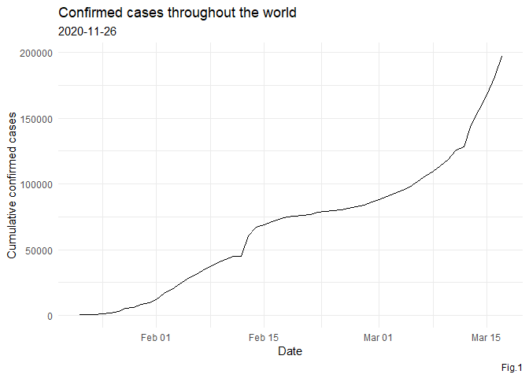
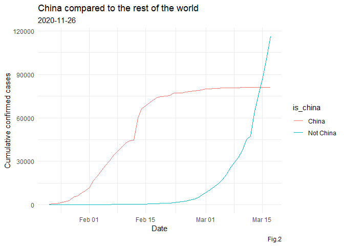
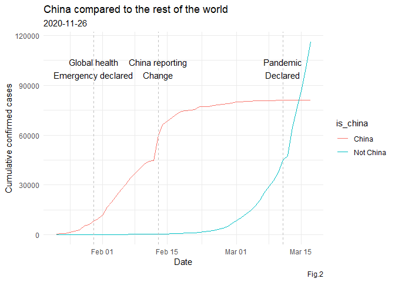
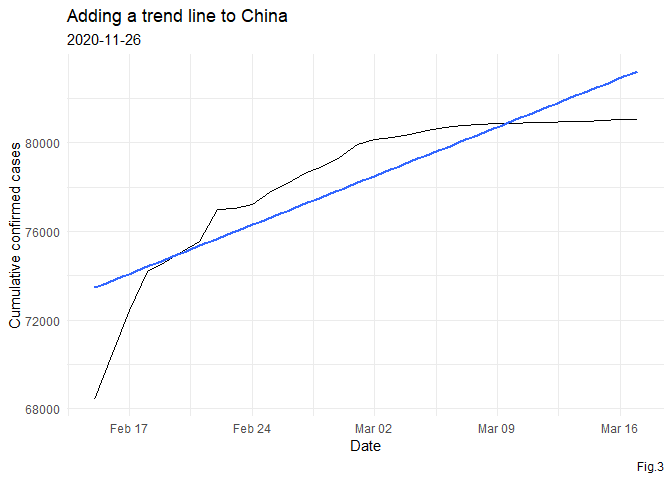
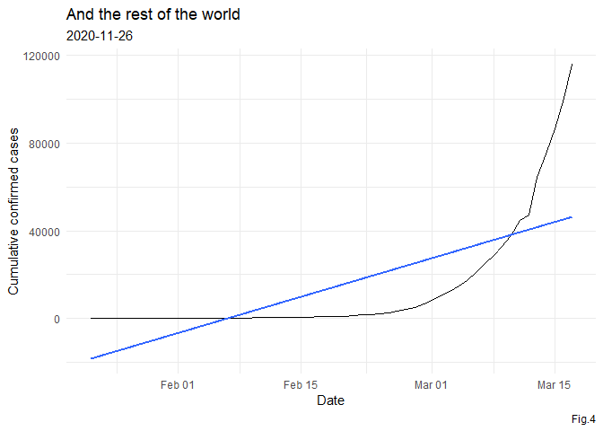
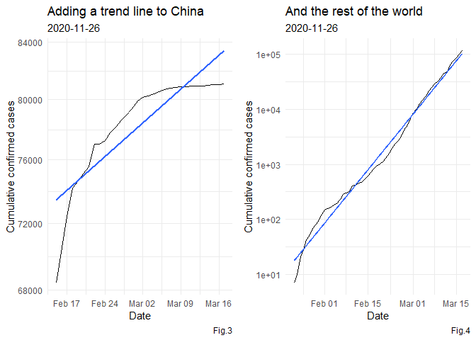
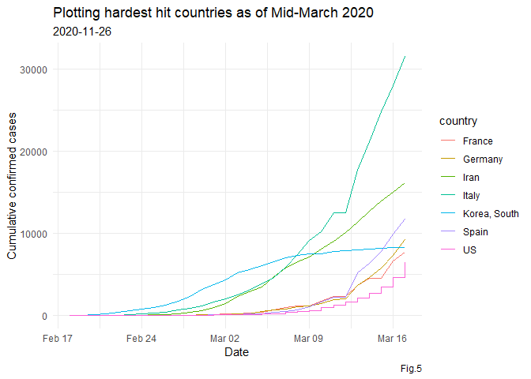

VISUALIZING COVID-19
================

## About

  - Course: Datacamp
  - Date: 09202020
  - Project: Visualizing Covid-19
  - Reference: <https://github.com/RamiKrispin/coronavirus>

## 1\. From epidemic to pandemic

In December 2019, COVID-19 coronavirus was first identified in the Wuhan
region of China. By March 11, 2020, the World Health Organization (WHO)
categorized the COVID-19 outbreak as a pandemic. A lot has happened in
the months in between with major outbreaks in Iran, South Korea, and
Italy.

Please note that information and data regarding COVID-19 is frequently
being updated. The data used in this project was pulled on March 17,
2020, and should not be considered to be the most up to date data
available.

``` r
# load package
if(!require("pacman")) install.packages("pacman")
pacman::p_load(readr, ggplot2, dplyr, gridExtra)

# set environment
options(digits = 3)
theme_set(theme_minimal())
```

## 2\. Confirmed cases throughout the world

The table above shows the cumulative confirmed cases of COVID-19
worldwide by date. Just reading numbers in a table makes it hard to get
a sense of the scale and growth of the outbreak. Let’s draw a line plot
to visualize the confirmed cases worldwide.

``` r
# read dataset
file = "Data/confirmed_cases_worldwide.csv"
confirmed_cases_worldwide = read_csv(file)

# see result
tibble(confirmed_cases_worldwide)
```

    ## # A tibble: 56 x 2
    ##    date       cum_cases
    ##    <date>         <dbl>
    ##  1 2020-01-22       555
    ##  2 2020-01-23       653
    ##  3 2020-01-24       941
    ##  4 2020-01-25      1434
    ##  5 2020-01-26      2118
    ##  6 2020-01-27      2927
    ##  7 2020-01-28      5578
    ##  8 2020-01-29      6166
    ##  9 2020-01-30      8234
    ## 10 2020-01-31      9927
    ## # ... with 46 more rows

``` r
# plot data
ggplot(data = confirmed_cases_worldwide, aes(x = date, y = cum_cases)) +
    geom_line() +
    labs(title = "Confirmed cases throughout the world",
         subtitle = Sys.Date(),
         caption = "Fig.1",
         x = "Date",
         y = "Cumulative confirmed cases",
         size = 5)
```

<!-- -->

## 3\. China compared to the rest of the world

The y-axis in that plot is pretty scary, with the total number of
confirmed cases around the world approaching 200,000. Beyond that, some
weird things are happening: there is an odd jump in mid February, then
the rate of new cases slows down for a while, then speeds up again in
March. We need to dig deeper to see what is happening.

Early on in the outbreak, the COVID-19 cases were primarily centered in
China. Let’s plot confirmed COVID-19 cases in China and the rest of the
world separately to see if it gives us any insight.

We’ll build on this plot in future tasks. One thing that will be
important for the following tasks is that you add aesthetics within the
line geometry of your ggplot, rather than making them global aesthetics.

``` r
# read dataset
file = "Data/confirmed_cases_china_vs_world.csv"
confirmed_cases_china_vs_world = read_csv(file)

# see result
glimpse(confirmed_cases_china_vs_world)
```

    ## Rows: 112
    ## Columns: 4
    ## $ is_china  <chr> "China", "China", "China", "China", "China", "China", "Ch...
    ## $ date      <date> 2020-01-22, 2020-01-23, 2020-01-24, 2020-01-25, 2020-01-...
    ## $ cases     <dbl> 548, 95, 277, 486, 669, 802, 2632, 578, 2054, 1661, 2089,...
    ## $ cum_cases <dbl> 548, 643, 920, 1406, 2075, 2877, 5509, 6087, 8141, 9802, ...

``` r
# plot data
p = ggplot(data = confirmed_cases_china_vs_world) +
    geom_line(aes(x = date, y = cum_cases, group = is_china, col = is_china)) +
    labs(title = "China compared to the rest of the world",
         subtitle = Sys.Date(),
         caption = "Fig.2",
         x = "Date",
         y = "Cumulative confirmed cases",
         size = 5)
p
```

<!-- -->

## 4\. Let’s annotate\!

Wow\! The two lines have very different shapes. In February, the
majority of cases were in China. That changed in March when it really
became a global outbreak: around March 14, the total number of cases
outside China overtook the cases inside China. This was days after the
WHO declared a pandemic.

There were a couple of other landmark events that happened during the
outbreak. For example, the huge jump in the China line on February 13,
2020 wasn’t just a bad day regarding the outbreak; China changed the way
it reported figures on that day (CT scans were accepted as evidence for
COVID-19, rather than only lab tests).

``` r
# set notation
who_events = tribble(
    ~ date, ~ event,
    "2020-01-30", "Global health\nEmergency declared",
    "2020-03-11", "Pandemic\nDeclared",
    "2020-02-13", "China reporting\nChange"
) %>% mutate(date = as.Date(date))
tibble(who_events)
```

    ## # A tibble: 3 x 2
    ##   date       event                              
    ##   <date>     <chr>                              
    ## 1 2020-01-30 "Global health\nEmergency declared"
    ## 2 2020-03-11 "Pandemic\nDeclared"               
    ## 3 2020-02-13 "China reporting\nChange"

``` r
# plot data
p + geom_vline(data = who_events, aes(xintercept = date), linetype = "dashed", col = "grey") +
    geom_text(data = who_events, aes(x = date, label = event), y = 100000, size = 4)
```

<!-- -->

## 5\. Adding a trend line to China

When trying to assess how big future problems are going to be, we need a
measure of how fast the number of cases is growing. A good starting
point is to see if the cases are growing faster or slower than linearly.

There is a clear surge of cases around February 13, 2020, with the
reporting change in China. However, a couple of days after, the growth
of cases in China slows down. How can we describe COVID-19’s growth in
China after February 15, 2020?

``` r
# filter data
china_after_feb15 = confirmed_cases_china_vs_world %>%
    filter(is_china == "China", date >= "2020-02-15")

# plot data
p.1 = ggplot(data = china_after_feb15, aes(x = date, y = cum_cases)) +
      geom_line() +
      geom_smooth(method = "lm", se = F) +
      labs(title = "Adding a trend line to China",
           subtitle = Sys.Date(),
           caption = "Fig.3",
           x = "Date",
           y = "Cumulative confirmed cases",
           size = 5)
p.1
```

<!-- -->

## 6\. And the rest of the world?

From the plot above, the growth rate in China is slower than linear.
That’s great news because it indicates China has at least somewhat
contained the virus in late February and early March.

How does the rest of the world compare to linear growth?

``` r
# filter data
not_china = confirmed_cases_china_vs_world  %>% 
    filter(is_china != "China")

# plot data
p.2 = ggplot(data = not_china, aes(x = date, y = cum_cases)) +
      geom_line() +
      geom_smooth(method = "lm", se = F) +
      labs(title = "And the rest of the world",
           subtitle = Sys.Date(),
           caption = "Fig.4",
           x = "Date",
           y = "Cumulative confirmed cases",
           size = 5)
p.2
```

<!-- -->

## 7\. Adding a logarithmic scale

From the plot above, we can see a straight line does not fit well at
all, and the rest of the world is growing much faster than linearly.
What if we added a logarithmic scale to the y-axis?

``` r
# transform log
p.1 = p.1 + scale_y_log10()
p.2 = p.2 + scale_y_log10()
grid.arrange(p.1, p.2, nrow = 1)
```

<!-- -->

## 8\. Which countries outside of China have been hit hardest?

With the logarithmic scale, we get a much closer fit to the data. From a
data science point of view, a good fit is great news. Unfortunately,
from a public health point of view, that means that cases of COVID-19 in
the rest of the world are growing at an exponential rate, which is
terrible news.

Not all countries are being affected by COVID-19 equally, and it would
be helpful to know where in the world the problems are greatest. Let’s
find the countries outside of China with the most confirmed cases in our
dataset.

``` r
# read data
file = "Data/confirmed_cases_by_country.csv"
confirmed_cases_by_country = read_csv(file)

# group data
top_countries_by_total_cases = confirmed_cases_by_country %>%
    group_by(country) %>%
    summarize(total_cases = max(cum_cases)) %>%
    top_n(7, total_cases)

# see result
top_countries_by_total_cases
```

    ## # A tibble: 7 x 2
    ##   country      total_cases
    ##   <chr>              <dbl>
    ## 1 France              7699
    ## 2 Germany             9257
    ## 3 Iran               16169
    ## 4 Italy              31506
    ## 5 Korea, South        8320
    ## 6 Spain              11748
    ## 7 US                  6421

## 9\. Plotting hardest hit countries as of Mid-March 2020

Even though the outbreak was first identified in China, there is only
one country from East Asia (South Korea) in the above table. Four of the
listed countries (France, Germany, Italy, and Spain) are in Europe and
share borders. To get more context, we can plot these countries’
confirmed cases over time.

Finally, congratulations on getting to the last step\! If you would like
to continue making visualizations or find the hardest hit countries as
of today, you can do your own analyses with the latest data available.

``` r
# read data
file = "Data/confirmed_cases_top7_outside_china.csv"
confirmed_cases_top7_outside_china = read_csv(file)

# plot data
ggplot(data = confirmed_cases_top7_outside_china, aes(x = date, y = cum_cases, group = country, col = country)) +
    geom_line() +
    labs(title = "Plotting hardest hit countries as of Mid-March 2020",
         subtitle = Sys.Date(),
         caption = "Fig.5",
         x = "Date",
         y = "Cumulative confirmed cases",
         size = 5)
```

<!-- -->

This is the end of the document.
